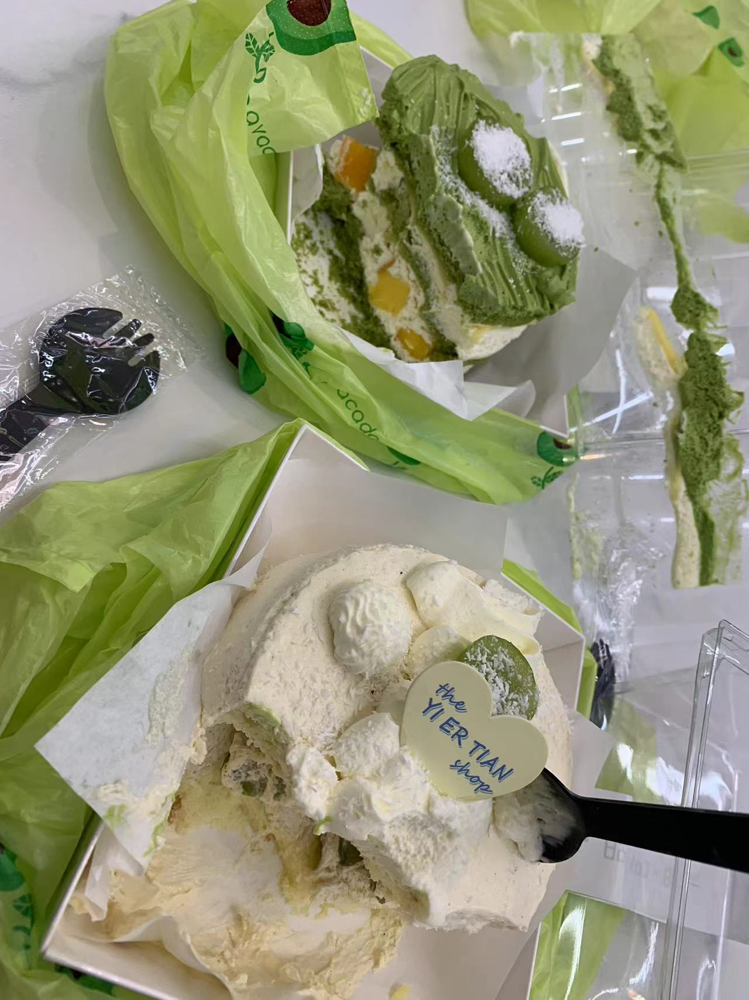

大家好我的学号是102202141黄昕怡，我的专业是数据专业和大数据技术，是计算机学院的学生，我要把这份文档上传到github上作为我的个人介绍。
github目前操作还不算熟练，只会copy别人的代码，不过我会学习的。
以下是我比较官方的自我介绍:
你好，我是黄昕怡，一名热情的计算机科学专业学生。我对编码和技术创新有着浓厚的兴趣，一直致力于通过技术解决实际问题。

🔍 专业背景：

目前就读于数据科学与大数据技术专业，不断深化我的技术技能，包括高级数据处理和机器学习。
我有使用多种编程语言的经验，包括Python、Java，可能会一点Spark和Hadoop进行大数据分析。
比较熟悉的编程语言应该是python,其他的实践经验可能比较少。

💡 项目经验：
**我在github上目前还没有什么项目，我自己的代码一般保存在本地。**
为了学习有从github上下载代码包，这是一个很好的开源社区。
我对开源项目特别感兴趣，并积极参与社区，以学习和贡献。
🌱 兴趣与成长：
我今天晚上吃了一块小蛋糕，这个就是我平时的兴趣爱好，青提茉莉特别好吃。

以下是我对他的赞美。
青提茉莉蛋糕是一款独具匠心的甜品，将清新的青提与优雅的茉莉花香巧妙地融合在一起。在一次偶然的下午茶时光中，我有幸品尝到了这款别致的蛋糕，它的味道和构造都让人难以忘怀。

蛋糕的外观十分精致，顶层撒有碎碎的青提果粒，犹如翡翠般点缀在蛋糕的表面，光是看着就让人心生欢喜。轻轻一切，刀尖穿过柔软的奶油层，显露出里面湿润的蛋糕体，每一层都透露出茉莉的清香和青提的清新。

第一口，蛋糕的口感细腻柔和，茉莉花的香气温婉扑鼻，与之相随的是青提的果香和轻微的酸甜，如同初夏的微风拂过，令人感觉清新愉悦。青提的果粒在口中轻轻爆开，带来一丝丝的惊喜和满足，使得整个味蕾都沉浸在这独特的风味之中。

这款青提茉莉蛋糕不仅仅是一种味觉的享受，更像是一次美妙的感官之旅。它将传统的蛋糕制作技艺和现代的创新口味完美结合，每一口都让人回味无穷，久久不能忘怀。在忙碌的生活中，偶尔给自己一份这样的甜蜜，是对日常的一种美好慰藉。

#### 个人成长
对我来说比较关键性的成长还是期末周，不在期末周我永远不知道我的潜力原来能这么无限。短暂的时间内爆发出非同一般的能力，掌握最多的知识。
还有比较关键的成长是有一段实验室写推荐系统论文的经历，半点小蛋糕的甜蜜都没有，跑实验求performance的惨痛血泪史实在令我印象深刻，一时半会写不完。
省略，而且我觉得我论文也中不了，所以我希望看到这篇自我介绍的人不要深入闻讯。

📫 联系我：
欢迎在GitHub上关注我，如果你对我的项目感兴趣或想一起讨论技术问题，随时欢迎与我联系。
希望通过我的工作和贡献，能在技术社区中找到志同道合的朋友。让我们一起创造令人激动的东西吧！

### 未来三年的目标是：
**平安地度过每一次地期末考试，能考出不错的成绩更好。**
**多读两年书啃两年老，享受学生生活，可能会读研究生。**
